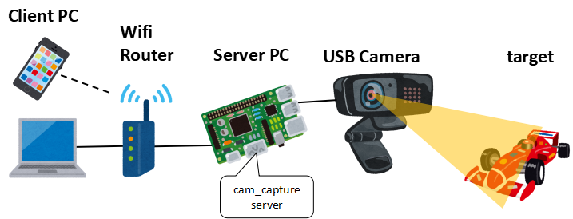

# cam_capture




---


## Overview
* The cam_capture captures high frame rate USB camera video.  
* The video format supported by cam_capture is MJPEG.  
* The cam_capture is a web application.

## Operating environment (operation has been confirmed)
* Server
  * Ubuntu22.04 or later
* Client
  * google chrome for windows
  * google chrome for android

## Setup environment
### add video group permission  
(reconnect the terminal to reflect the settings)
```
$  sudo gpasswd -a $USER video
```
### install python environment
```
$ cd cam_capture/web_app
$ sudo apt install python3-pip
$ pip3 install -r requirements.txt
$ sudo apt install v4l-utils
```

### install ffmpeg environment
```
$ sudo apt install ffmpeg
```

### setup crontab
  * If you want to start the Flask server at the same time as the PC starts
```
$ crontab -e
```
write this definition and save
```
@reboot cd (full path of cam_capture)/web_app && bash (full path of cam_capture)/web_app/server_run.sh
```

### Connect USB camera
* display usb device
```
$ ls /dev/video*
/dev/video0  /dev/video1
```
  * How to see the resolutions and formats supported by the camera
```
$ sudo apt install v4l-utils
$ v4l2-ctl --list-formats-ext
```
